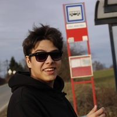
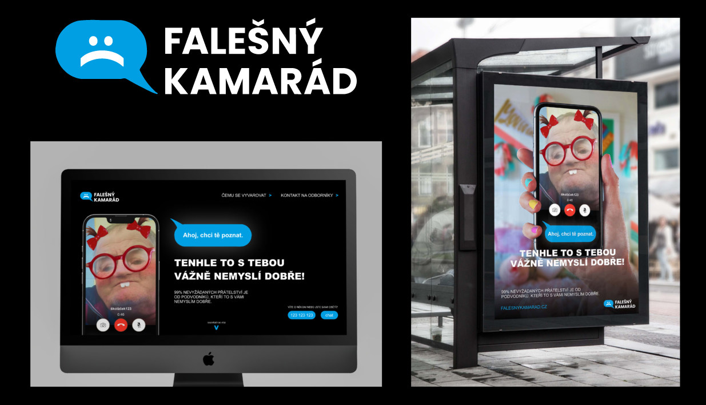
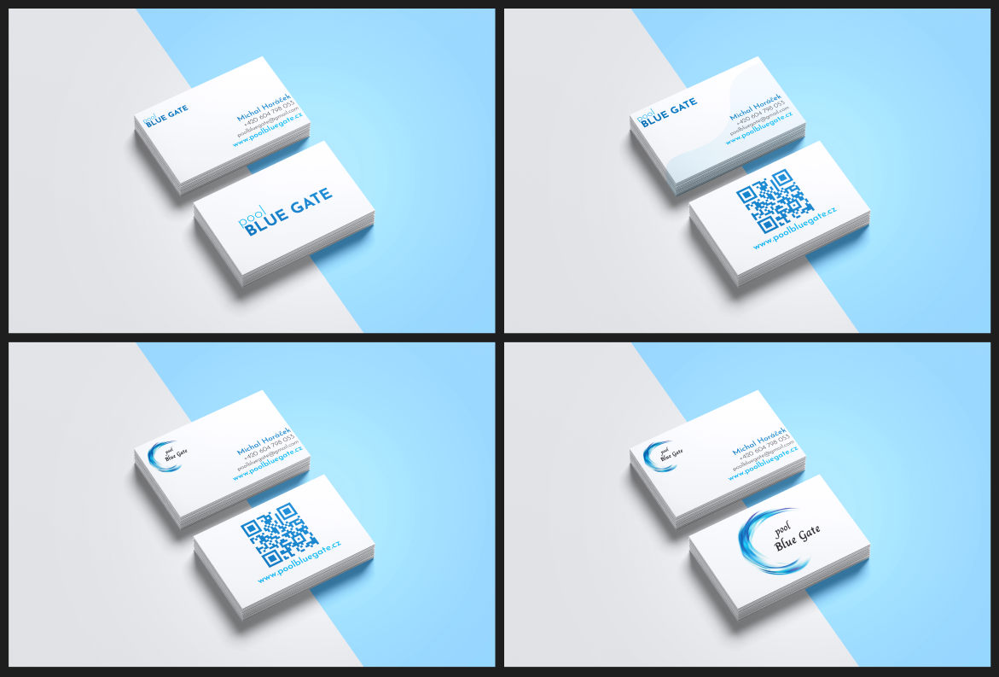
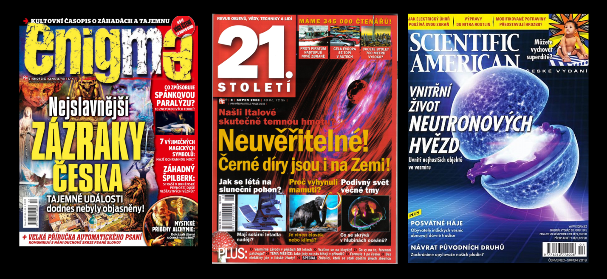
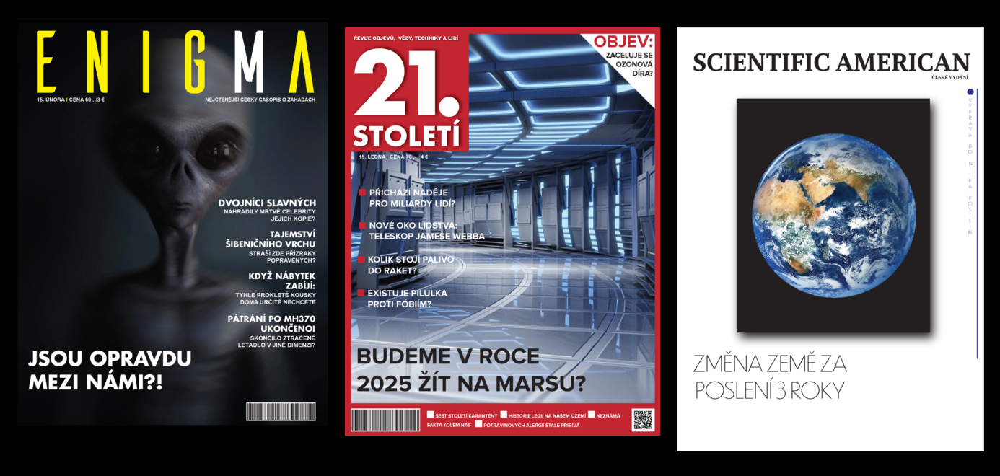

# Hello, I'm Jan Výborný

  My design journey began around 2012 when I got introduced to art classes. Since then I fell in love with the way of expressing my views through art in general. In late 2014 I found photography, my favourite way of capturing a moment.
  
  Following my art path, I ended up in a high school where “graphic design” was my major in general. I learned different ways of creating designs from posters, my own fonts, and pre-press. This school gave me a good start to my later years. After finishing my high school I joined a local college focused on graphic and media design. This school has given me by far the most knowledge I have today. Thanks to the collages contacts I was able to create for real clients and I learned the marketing side of design.

## Featured work

### Fake Friend

- Work I've done with my friends as part of school work. Theme was to show people (exactly young people) how internet is dangerous.
- The project ended well. The client liked our design and thought behind it. We had to edit a little part which was the pictures of predators.
Predators are from USA but it was still a problem so we edited it with our own. Overall everything was good.

### PoolBlueGate

- A simple redesign of a logo for PoolBlueGate company. I designed a redesign for a business card with the new logo.
The company enjoyed my design but decided to go with their previous logo. 

### Redesign of Magazines

