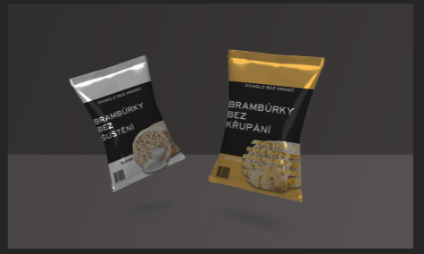

# Thesis Presentation

Best to use with [PDF](08-thesis-prezentation/prez_thes.pdf)

- ## Slide: 01

For my bachelor's thesis, I chose theatre. Here are two main factors for my decision. Im into acting and I loved it since my youth. The second thought is the challenge. To give you some background redesigning a theatre was one of the tasks given to us in school. I felt super demotivated and I wasn't feeling "the spark" in the work. I wanted to prove that Im able to redesign theatre on my own even tho it's a large bite.

- ## Slide: 02

My chosen theatre is Divadlo Bez Hranic (aka Theatre Without Borders). It's a small theatre with a capacity of 80-100 spectators. I wanted to create something without borders and shine "the spotlight" on it. 

- ## Slide: 03
 
The second main thought was to create unique posters. Since posters of theatre are hard to find and the only one I found needed a cleaner layout.

- ## Slide: 04
 
First I redesigned the logo which in my opinion looked too old. I used two variants one normal and the second condensed. It's cleaner and also I let go of the mask pictogram which is so much connected with the theatre.

- ## Slide: 05

In the posters, I was quite not sure how to portray my thought. The first idea was to create posters connected to the theatre and the actors themselves. Look at them was quite punk looking. The main thought was that posters would be used as paper for actors to write their thoughts on their scripts.

- ## Slide: 06

The thought I went for in the end was my favourite one. The idea behind this design is that everyone has a different view of the play. Not only in perspective speaking matter but from emotions and mind way. Pictures from plays are sliced and coloured to their designed themes. All of the coloured slices are representing different views of the audience. 

My concepts lays on the thought of creating these for the theatre. We have Divadlo Bez Diplomu, Divadlo Bez Hendikepu and Divadlo Bez Domova. Theatre Witouth: Diploma, Handicaps and Home. Also, a normal variant of theatre plays is included. 
I differentiated the themes into colours for easier recognition.

Without Diploma: This is for young students of theatre and acting schools to be able to create a name for themselves.
Without Handicaps: For all the handicapped citizens to give them a safe space to also enjoy theatre.
Without Home: This is for all of the foreign citizens and foreigners that are here either from their own will or because of the politic or other state. Its to give them a small taste of their own culture and language.

- ## Slide: 07

Also, I created posters for the subway. In my opinion its the most efficient way of propagation in the mater of print adverts speaking.

- ## Slide: 09

The second of my main goals was to create a theatre that can collaborate with companies and such. Not only theatres and audiences were my target.

I created three themes for companies.
Divadlo Bez Kravaty, Divadlo Bez Dedlinu and Divadlo Bez Masky. In English, these are Theatre Without Tye,  Theatre Without Deadline and  Theatre Without Mask. 

Theatre Without Tye: For teambuilding purposes, doing small skits is a better way to get to know your coworkers.
Theatre Without Deadline: Parties, Events, basically any company-free activities without stressing about time.
Theatre Without Mask: Presenting a company or product without lies and nothing hiding. 

- ## Slide: 10

Socials are connected with the same structure and same posts to keep the viewer in the same "ecosystem". Mainly focused on the posts of plays, events and life behind the curtains.

- ## Slide: 11

For the rest of the used designs, I created tickets which should work as a bookmark or a small poster itself.

Programme is created with the purpose of propagation on socials. One page of the program has cutout stripes with coloured plastic. Viewers can choose from black and white variants. Under the cutouts is a tag for theatre on socials. So it can propagate it self.

Lastly, I created some merch which corresponds with the thought "without borders"

- We have sweatpants: To be more comfortable.
- We have slippers: Ladye's shoes are really uncomfortable and hard on the feet. This product is paired with socks. So people are not cold.
- We have pillows: For your back or if you can't see over the large individual in front of you.
- We also have small dink and chips: Wine can be really messy sometimes. It's good that you have our sweatpants so you won't ruin your beautiful dress. Best to pair the drink with rice crackers which come in two flavours. Cheese and Salt. Chips without crunch and without rustle.

That's it. Thank you for reading.

